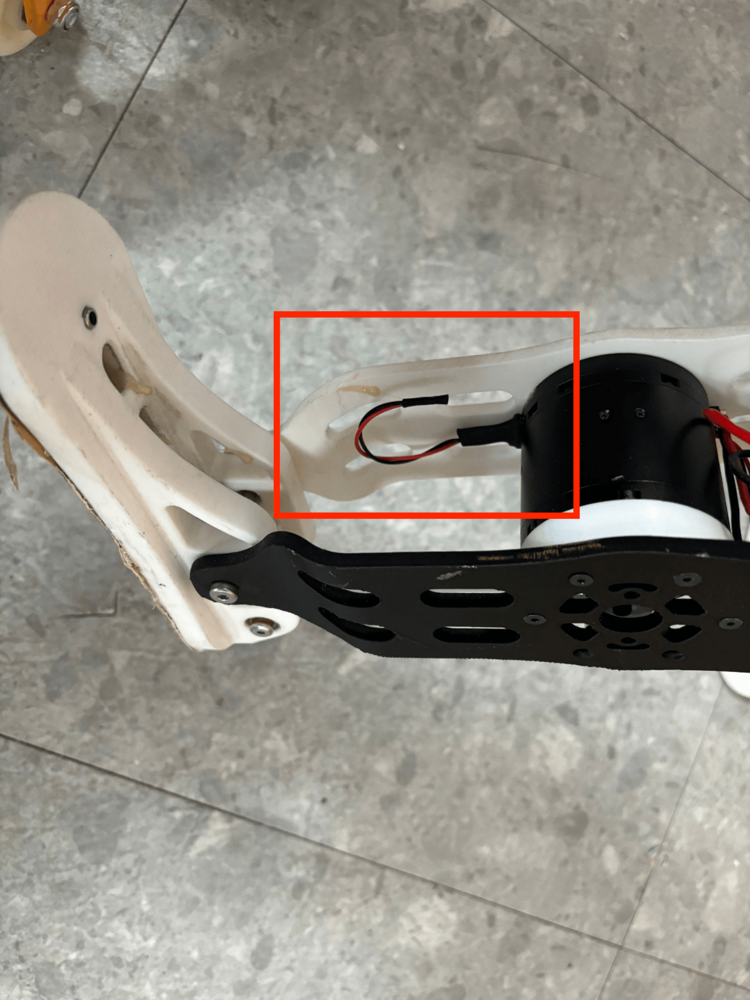
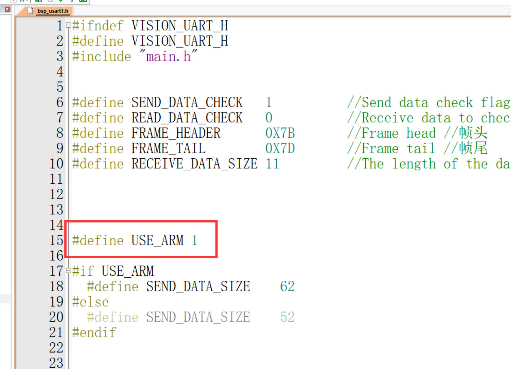
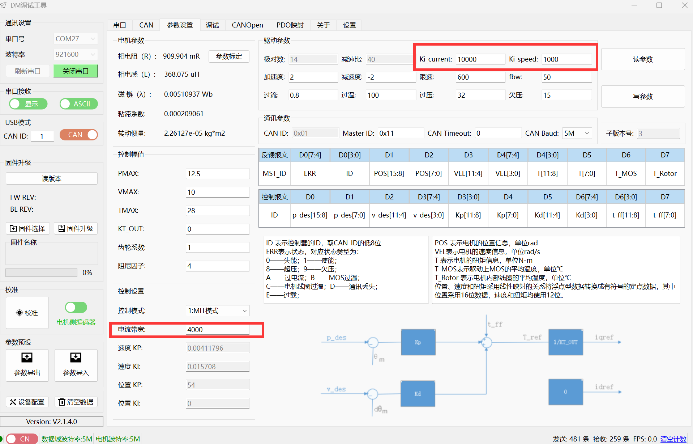
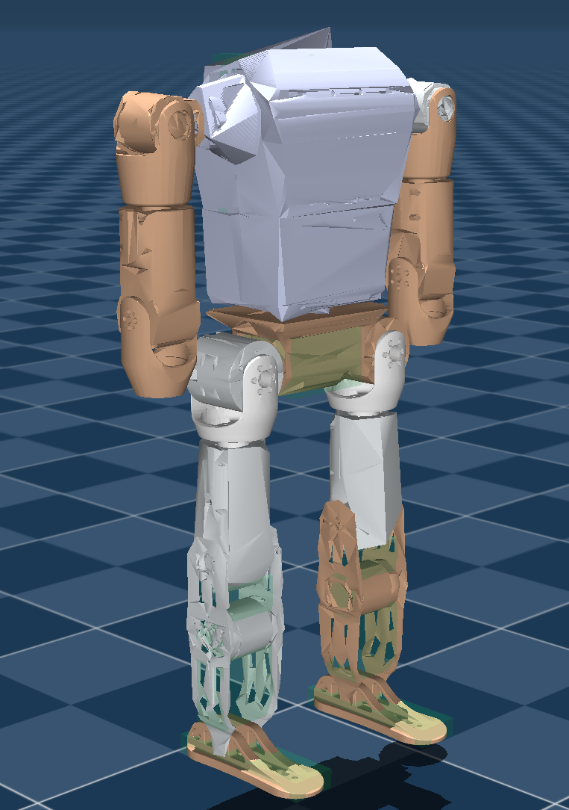

# bipedal-robot

## 项目简介

这是达妙开源小人形下位机程序，程序跑在达妙MC02开发板上。

该程序实现**usb转canfd功能**，一方面将上位机通过usb传来的数据以canfd协议转发给电机，
另一方面通过canfd读取电机回传数据，再通过usb虚拟串口传给上位机。

## 安装与使用

使用该程序前，需要进行一些小操作，如下：

#### 1.接120欧电阻

***注意：左右两腿的最末端电机，也就是控制foot的电机必须要接上120欧电阻，因为与电机通信使用canfd***

***注意：上半身两手臂末端总共只需要接一个电阻，也就是要么左臂最后一个电机打开终端电阻，要么右臂最后一个电机打开终端电阻***

连接如下所示：

#### 2.修改软件

程序默认是有手臂的版本，如果是没有手臂（只有下肢10个DM4340电机和一个DM6006电机），则需要将程序的USE_ARM定义为0，改的地方如下所示：

#### 3.设置电机id

根据硬件接线图，对每个电机设置对应的can_id和mst_id。

#### 4.设置电机波特率

每个电机改成5M波特率。

#### 5.给腿部10个4340电机更改3个参数

用调试助手更改，如下图所示：

#### 6.设置零点

按照下图，给每个电机设置零点：

运行上位机程序（部署代码）前，先将该STM32代码直接烧录到达妙stm32h7开发板里，确保单片机程序正常工作后再运行上位机程序。

#### 7.程序测试

通过debug，观察数组mybuff[]、mybuff2[]、mybuff3[]每个元素的递增情况。
