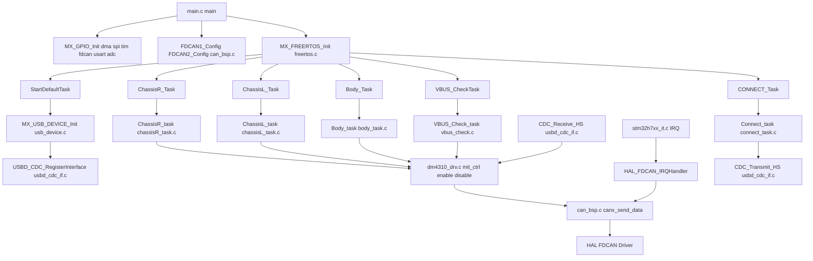
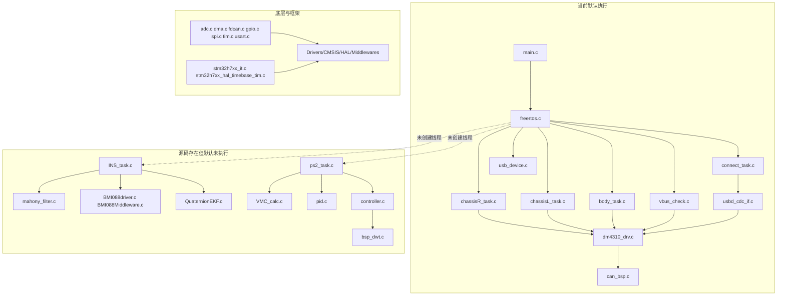

# 下位机工程完整讲解（融合版）

说明：本文档仅用于工程解读、调试指导与联调规范，不包含任何源码改动。

## 1. 工程定位

这份工程是达妙小人形机器人下位机程序，核心职责是：

1. 通过 USB CDC 接收上位机命令。
2. 将命令转换为 CANFD 电机控制帧。
3. 收集电机反馈并经 USB 回传。
4. 执行基础安全策略（欠压报警与失能）。

参考：`README.md:1`

从现状看，它是“可运行主链路 + 多算法储备模块”结构。主链路在线，部分算法模块保留但默认未接入任务调度。

## 2. 目录与分层

### 2.1 `Core/`

CubeMX 生成的主流程与外设初始化，含 `main.c`、`freertos.c`、`fdcan.c`、`usart.c`、`spi.c`、`adc.c`、`stm32h7xx_it.c`。

### 2.2 `User/Bsp/`

板级功能与通信桥接：

1. `can_bsp.c`：FDCAN 过滤器、发送封装、接收回调分发。
2. `bsp_dwt.c`：高精度计时与延时。
3. `bsp_usart1.c`：串口收发与校验（部分路径已注释）。

### 2.3 `User/Devices/`

器件驱动：

1. `DM_Motor/dm4310_drv.*`：DM 系列电机协议。
2. `BMI088/*`：IMU 寄存器读写与初始化。

### 2.4 `User/APP/`

任务逻辑：

1. `chassisR_task.c`
2. `chassisL_task.c`
3. `body_task.c`
4. `connect_task.c`
5. `vbus_check.c`
6. `INS_task.c`（存在但当前未被 RTOS 线程创建）
7. `ps2_task.c`（存在但当前未被 RTOS 线程创建）

### 2.5 `User/Algorithm/` 与 `User/Controller/`

算法库与控制器库：Mahony、Kalman、EKF、VMC、传统PID、增强PID（Fuzzy/LDOB/TD）。

### 2.6 执行过程 vs 库（明确标记）

下面按“上电后是否直接参与运行”来划分。

#### A. 执行过程（运行时主链路）

这些文件和模块会在当前工程配置下直接参与启动、调度、中断或任务执行。

1. 启动与调度主链路：
2. `DM-robot/Core/Src/main.c`
3. `DM-robot/Core/Src/freertos.c`
4. `DM-robot/Core/Src/stm32h7xx_it.c`
5. `DM-robot/Core/Src/stm32h7xx_hal_timebase_tim.c`
6. 外设初始化与中断服务（被主链路调用）：
7. `DM-robot/Core/Src/fdcan.c`
8. `DM-robot/Core/Src/gpio.c`
9. `DM-robot/Core/Src/dma.c`
10. `DM-robot/Core/Src/spi.c`
11. `DM-robot/Core/Src/usart.c`
12. `DM-robot/Core/Src/adc.c`
13. `DM-robot/Core/Src/tim.c`
14. 当前已创建并运行的 RTOS 任务：
15. `DM-robot/User/APP/chassisR_task.c`
16. `DM-robot/User/APP/chassisL_task.c`
17. `DM-robot/User/APP/body_task.c`
18. `DM-robot/User/APP/connect_task.c`
19. `DM-robot/User/APP/vbus_check.c`
20. 运行时必经通信与设备驱动：
21. `DM-robot/User/Bsp/can_bsp.c`
22. `DM-robot/User/Devices/DM_Motor/dm4310_drv.c`
23. `DM-robot/USB_DEVICE/App/usbd_cdc_if.c`
24. `DM-robot/USB_DEVICE/App/usb_device.c`

结论：这些部分属于“执行过程代码”，会直接影响当前固件运行行为。

#### B. 库/框架（提供能力，不等于业务流程）

这些模块主要提供基础能力、通用算法或第三方实现，本身不是业务主流程。

1. HAL/CMSIS/中间件：
2. `DM-robot/Drivers/CMSIS/**`
3. `DM-robot/Drivers/STM32H7xx_HAL_Driver/**`
4. `DM-robot/Middlewares/**`
5. `DM-robot/USB_DEVICE/Target/**`（底层 USB 适配）
6. 算法与控制器库（是否执行取决于是否被任务调用）：
7. `DM-robot/User/Algorithm/**`
8. `DM-robot/User/Controller/**`
9. 设备库中“可选/未接入链路”的部分：
10. `DM-robot/User/Devices/BMI088/**`（当前主链路默认未启用 INS 线程时不参与控制闭环）

结论：这些部分属于“库”。它们提供接口和能力，但只有被任务或主流程调用后才转为执行过程的一部分。

#### C. 当前工程中“存在但默认不执行”的典型例子

1. `DM-robot/User/APP/INS_task.c`：文件存在，但默认未在 `MX_FREERTOS_Init` 创建线程。
2. `DM-robot/User/APP/ps2_task.c`：文件存在，但默认未在 `MX_FREERTOS_Init` 创建线程。
3. `DM-robot/User/Algorithm/*` 中多数高级算法：作为算法库保留，需显式接入任务循环才会生效。

判定口诀：

1. `main.c/freertos.c` 是否直接调用。
2. 中断向量表是否注册并触发。
3. 线程是否真的被 `osThreadNew` 创建。
4. 模块函数是否在周期循环内被调用。

### 2.7 算法库调用关系映射表

下表总结每个算法库的**定义位置**、**对外函数**、**谁在使用**、以及**当前执行状态**。

| 算法库                                          | 定义文件                                  | 主对外函数                                                                                                                   | 被谁调用                                                       | 当前状态                                | 备注                                                |
| ----------------------------------------------- | ----------------------------------------- | ---------------------------------------------------------------------------------------------------------------------------- | -------------------------------------------------------------- | --------------------------------------- | --------------------------------------------------- |
| **Mahony**                                | `User/Algorithm/mahony/mahony_filter.c` | `mahony_init()` `mahony_input()` `mahony_update()` `mahony_output()` `RotationMatrix_update()`                     | `INS_task.c:36,65~68`                                        | ❌**不执行**（INS_task 未被创建） | 文件存在，但所属线程默认未挂入 `MX_FREERTOS_Init` |
| **QuaternionEKF**                         | `User/Algorithm/EKF/QuaternionEKF.c`    | `IMU_QuaternionEKF_Init()` `IMU_QuaternionEKF_Update()`                                                                  | `main.c:35` 仅包含头文件，未被调用                           | ❌**不执行**                      | 头文件被 include，但无对象初始化与调用              |
| **通用 Kalman**                           | `User/Algorithm/kalman/kalman_filter.c` | `Kalman_Filter_Init()` `Kalman_Filter_Update()` 等五式                                                                   | `main.c:35` 仅包含头文件，未被调用                           | ❌**不执行**                      | 头文件被 include，但无实际应用                      |
| **VMC（五连杆）**                         | `User/Algorithm/VMC/VMC_calc.c`         | `VMC_init()` `VMC_calc_1_right()` `VMC_calc_1_left()` `VMC_calc_2()` `ground_detectionR()` `ground_detectionL()` | `ps2_task.c:127~128` 外声明结构体                            | ❌**不执行**（ps2_task 未被创建） | 链接器已优化移除（`.map` Removing vmc_calc.o）    |
| **基础 PID**                              | `User/Algorithm/PID/pid.c`              | `PID_init()` `PID_Calc()` `PID_clear()`                                                                                | `body_task.h` 包含头文件，`body_task.c` 中**无调用** | ❌**不执行**                      | 头文件被包含但函数未使用                            |
| **增强 PID**（Fuzzy/LDOB/TD/Feedforward） | `User/Controller/controller.c`          | `PID_Init()` `PID_Calculate()` `Fuzzy_Rule_Init()` `Feedforward_Init()` `LDOB_Init()` `TD_Calculate()`           | **无任何调用**                                           | ❌**不执行**                      | 函数库完整，但无应用实例                            |

#### 2.7.1 不执行原因分析

1. **线程未创建** → Mahony(INS)、VMC(ps2)

   - 文件代码完整。
   - 对应 RTOS 线程默认未在 `MX_FREERTOS_Init()` 中由 `osThreadCreate()` 创建。
   - 检查：`DM-robot/Core/Src/freertos.c:106` 仅创建 6 个线程。
2. **头文件 include 但无调用** → QuaternionEKF、Kalman、基础 PID

   - 库代码编译链接，头文件被 include。
   - 但代码无对象初始化（如 `Kalman_Filter_Init(&myKF, ...)`）。
   - 检查：`main.c:35,36` 仅 include；`body_task.c` 无 `PID_init()` 调用。
3. **库完整但无应用** → 增强 PID（Fuzzy/LDOB/TD)

   - API 设计完善，函数实现完整。
   - 工程无全局对象声明（如 `PID_t myPid;`）。
   - 任务直接用 MIT/POS/SPEED 下的电机命令。
   - 检查：`chassis*_task.c` 直接调 `mit_ctrl2()`，无 `PID_Calculate()`。

#### 2.7.2 当前执行过程不使用算法的核心原因

主链路采用**开环或硬编码参数**：

- **腿部**（ChassisR/L）：MIT 模式参数直接下发，无 Kalman/VMC/PID 闭环。
- **躯干**（Body）：同腿部。
- **通信**（Connect）：纯数据搬运。
- **安全**（VBUS）：电压阈值检测。
- **姿态**：硬件 IMU 提供，Mahony 库存在但 INS_task 未被创建。

#### 2.7.3 快速激活算法（以 Mahony 为例）

1. 在 `DM-robot/Core/Src/freertos.c` 中解注释或新增线程创建：
   ```c
   osThreadDef(INS_TASK, INS_Task, osPriorityHigh, 0, 512);
   INS_TASKHandle = osThreadCreate(osThread(INS_TASK), NULL);
   ```
2. 确保 BMI088 初始化并定期采集。
3. INS_task 会自动调 `mahony_init()`、`mahony_update()` 融合 IMU 数据。
4. 其他任务读取 `INS.Roll/Pitch/Yaw` 使用。

同理，激活 VMC：创建 ps2_task → ps2 读取期望状态 → VMC_calc() 计算 → 电机驱动执行。

### 2.8 全文件调用关系与调用树（完整版）

说明：本节“所有文件”指业务工程可维护源码全集，即以下目录中的全部 `.c` 文件：

1. `DM-robot/Core/Src/*.c`
2. `DM-robot/User/APP/*.c`
3. `DM-robot/User/Bsp/*.c`
4. `DM-robot/User/Devices/**/*.c`
5. `DM-robot/User/Algorithm/**/*.c`
6. `DM-robot/User/Controller/*.c`
7. `DM-robot/USB_DEVICE/App/*.c`

第三方 `Drivers/**`、`Middlewares/**` 数量巨大，本节在调用树中作为“库叶子节点”统一折叠展示。

#### 2.8.1 运行态调用树（实际上电会执行）



文字说明：

1. 控制主链路是 `freertos.c` 创建的 6 个线程，最终都落到 `User/APP` 的 5 个业务任务和 1 个 USB 初始化任务。
2. 电机命令统一由 `dm4310_drv.c` 打包，通过 `can_bsp.c` 发送到 HAL FDCAN。
3. 电机反馈由 `FDCANx_IT0_IRQHandler -> HAL_FDCAN_IRQHandler -> HAL_FDCAN_RxFifoXCallback(can_bsp.c)` 回灌到 `chassis_move/robot_body`。
4. USB 下行命令由 `CDC_Receive_HS` 写入目标电机测试参数，USB 上行状态由 `Connect_task -> CDC_Transmit_HS` 周期回传。

#### 2.8.2 全量源码调用树（含未执行分支）



文字说明：

1. `INS_task.c`、`ps2_task.c` 虽在工程中，但 `MX_FREERTOS_Init` 未创建线程，所以所属算法链（Mahony/EKF/VMC/PID/Controller）默认不会进入运行态。
2. `controller.c` 内部大量使用 `DWT_GetDeltaT`，只有当其 API 被上层任务调用时才会触发 `bsp_dwt.c` 的运行时价值。
3. `memorymap.c` 为占位/配置文件，当前无业务调用边。

#### 2.8.3 全文件级调用关系表（逐文件）

| 文件                                       | 谁调用它（入边）                                                          | 它调用谁（出边）                                                                                                | 当前状态                 |
| ------------------------------------------ | ------------------------------------------------------------------------- | --------------------------------------------------------------------------------------------------------------- | ------------------------ |
| `Core/Src/main.c`                        | 启动入口                                                                  | `MX_*_Init`、`FDCAN1_Config`、`FDCAN2_Config`、`MX_FREERTOS_Init`                                       | 执行                     |
| `Core/Src/freertos.c`                    | `main.c`                                                                | `StartDefaultTask`、`ChassisR_Task`、`ChassisL_Task`、`CONNECT_Task`、`Body_Task`、`VBUS_CheckTask` | 执行                     |
| `Core/Src/stm32h7xx_it.c`                | 中断向量表                                                                | `HAL_FDCAN_IRQHandler`、`HAL_UART_IRQHandler`、`HAL_TIM_IRQHandler`、`HAL_PCD_IRQHandler`               | 执行                     |
| `Core/Src/stm32h7xx_hal_timebase_tim.c`  | HAL Tick 框架                                                             | TIM2 1ms Tick 回调链                                                                                            | 执行                     |
| `Core/Src/fdcan.c`                       | `main.c`                                                                | `MX_FDCAN1_Init`、`MX_FDCAN2_Init`、`MX_FDCAN3_Init`                                                      | 执行                     |
| `Core/Src/adc.c`                         | `main.c`                                                                | `MX_ADC1_Init`                                                                                                | 执行                     |
| `Core/Src/dma.c`                         | `main.c`                                                                | `MX_DMA_Init`                                                                                                 | 执行                     |
| `Core/Src/gpio.c`                        | `main.c`                                                                | `MX_GPIO_Init`                                                                                                | 执行                     |
| `Core/Src/spi.c`                         | `main.c`                                                                | `MX_SPI2_Init`                                                                                                | 执行                     |
| `Core/Src/tim.c`                         | `main.c`                                                                | `MX_TIM3_Init`、`MX_TIM12_Init`                                                                             | 执行                     |
| `Core/Src/usart.c`                       | `main.c`                                                                | `MX_USART1_UART_Init`                                                                                         | 执行                     |
| `Core/Src/stm32h7xx_hal_msp.c`           | HAL 内部                                                                  | 各外设 MSP Init/DeInit                                                                                          | 执行（被 HAL 间接调用）  |
| `Core/Src/system_stm32h7xx.c`            | 启动文件                                                                  | `SystemInit` 等系统底层                                                                                       | 执行                     |
| `Core/Src/memorymap.c`                   | 无直接调用                                                                | 无                                                                                                              | 已编译，运行影响弱       |
| `User/APP/chassisR_task.c`               | `freertos.c`                                                            | `ChassisR_init`、`mit_ctrl*`、`enable_motor_mode`                                                         | 执行                     |
| `User/APP/chassisL_task.c`               | `freertos.c`                                                            | `ChassisL_init`、`mit_ctrl*`、`enable_motor_mode`                                                         | 执行                     |
| `User/APP/body_task.c`                   | `freertos.c`                                                            | `body_init`、`mit_ctrl*`、`pos_speed_ctrl`                                                                | 执行                     |
| `User/APP/connect_task.c`                | `freertos.c`                                                            | `Check_Sum`、`CDC_Transmit_HS`                                                                              | 执行                     |
| `User/APP/vbus_check.c`                  | `freertos.c`                                                            | `HAL_ADC_Start_DMA`、`disable_motor_mode`、电源/Buzzer 控制                                                 | 执行                     |
| `User/APP/INS_task.c`                    | 无（线程未创建）                                                          | `mahony_*`、`RotationMatrix_update`、BMI088读写                                                             | 不执行                   |
| `User/APP/ps2_task.c`                    | 无（线程未创建）                                                          | 预留 VMC/平衡链路                                                                                               | 不执行                   |
| `User/Bsp/can_bsp.c`                     | `main.c`、`dm4310_drv.c`、HAL FDCAN 回调                              | `HAL_FDCAN_*`、`dm*_fbdata`                                                                                 | 执行                     |
| `User/Bsp/bsp_usart1.c`                  | `connect_task.c`、USART IRQ 回调                                        | `Check_Sum`、`HAL_UARTEx_ReceiveToIdle_DMA`                                                                 | 部分执行（主要校验函数） |
| `User/Bsp/bsp_dwt.c`                     | `main.c`（`DWT_Init`）                                                | `DWT_GetDeltaT`                                                                                               | 执行                     |
| `User/Bsp/bsp_PWM.c`                     | 当前未检出调用                                                            | `TIM_Set_PWM`                                                                                                 | 不执行                   |
| `User/Devices/DM_Motor/dm4310_drv.c`     | `chassis*`、`body_task`、`vbus_check`、`usbd_cdc_if`、`can_bsp` | `canx_send_data`、电机数据编解码                                                                              | 执行                     |
| `User/Devices/BMI088/BMI088driver.c`     | 设计上由 `INS_task.c` 调用                                              | SPI 读写与 IMU 配置                                                                                             | 默认不执行               |
| `User/Devices/BMI088/BMI088Middleware.c` | BMI088 驱动层                                                             | SPI 传输封装                                                                                                    | 默认不执行               |
| `USB_DEVICE/App/usb_device.c`            | `StartDefaultTask`                                                      | `USBD_Init`、`USBD_RegisterClass`、`USBD_CDC_RegisterInterface`                                           | 执行                     |
| `USB_DEVICE/App/usbd_cdc_if.c`           | USB CDC 类回调、`connect_task`                                          | `CDC_Receive_HS` 解析、`CDC_Transmit_HS` 发送、`dm*_fbdata_test`                                          | 执行                     |
| `USB_DEVICE/App/usbd_desc.c`             | `usb_device.c`                                                          | USB 描述符提供                                                                                                  | 执行                     |
| `User/Algorithm/mahony/mahony_filter.c`  | `INS_task.c`                                                            | 姿态融合函数                                                                                                    | 默认不执行               |
| `User/Algorithm/EKF/QuaternionEKF.c`     | 无直接调用                                                                | EKF 更新                                                                                                        | 不执行                   |
| `User/Algorithm/kalman/kalman_filter.c`  | 无直接调用                                                                | Kalman 通用五式                                                                                                 | 不执行                   |
| `User/Algorithm/VMC/VMC_calc.c`          | 设计上 `ps2_task.c`                                                     | 虚拟模型控制                                                                                                    | 默认不执行               |
| `User/Algorithm/PID/pid.c`               | 无直接调用                                                                | 基础 PID                                                                                                        | 不执行                   |
| `User/Controller/controller.c`           | 无直接调用                                                                | 增强 PID/Fuzzy/LDOB/TD                                                                                          | 不执行                   |

#### 2.8.4 使用方法（如何读这张树）

1. 先看 `2.8.1`：这是“现在板子上电后一定会走的路径”。
2. 再看 `2.8.2`：这是“源码里存在但默认未跑”的储备链。
3. 查具体文件时看 `2.8.3`：按“入边/出边/状态”三列快速定位。
4. 当你新增一个算法线程后，只需把它从 `INACTIVE` 子图移到 `ACTIVE` 子图即可完成文档维护。

## 3. 启动链路（从上电到任务运行）

主链路在 `DM-robot/Core/Src/main.c`：

1. `HAL_Init()`。
2. `SystemClock_Config()`。
3. `PeriphCommonClock_Config()`。
4. 初始化外设：GPIO、DMA、SPI2、TIM3、FDCAN3、USART1、FDCAN1、FDCAN2、ADC1、TIM12。
5. 用户初始化：
   1. `Buzzer_OFF`
   2. `DWT_Init(480)`
   3. `Power_OUT1_ON`、`Power_OUT2_ON`
   4. `FDCAN1_Config()`、`FDCAN2_Config()`
6. `MX_FREERTOS_Init()`。
7. `osKernelStart()`。

关键位置：`DM-robot/Core/Src/main.c:85`、`DM-robot/Core/Src/main.c:130`、`DM-robot/Core/Src/main.c:135`、`DM-robot/Core/Src/main.c:138`

## 4. 时钟、时基与周期体系

### 4.1 系统与总线时钟

1. 系统时钟来自 PLL，主频配置面向 480MHz。
2. AHB 与 APB 有分频，外设时钟独立配置。
3. FDCAN 使用 `PLL2` 作为时钟源。

参考：`DM-robot/Core/Src/main.c:158`、`DM-robot/Core/Src/main.c:190`、`DM-robot/Core/Src/main.c:219`

### 4.2 HAL Tick 与 RTOS Tick

1. HAL Tick 使用 TIM2 1ms 中断。
2. FreeRTOS Tick = 1000Hz。

参考：`DM-robot/Core/Src/stm32h7xx_hal_timebase_tim.c:19`、`DM-robot/Core/Inc/FreeRTOSConfig.h:64`

### 4.3 DWT 精计时

`bsp_dwt.c` 通过 `DWT->CYCCNT` 获取高精度 `dt`，用于控制与姿态算法。

参考：`DM-robot/User/Bsp/bsp_dwt.c:13`

## 5. 中断架构与优先级

### 5.1 关键中断源

1. FDCAN1/2/3 IT0。
2. SPI2。
3. USART1。
4. OTG_HS。
5. DMA1 Stream0~4。

参考：`DM-robot/Core/Inc/stm32h7xx_it.h:41`

### 5.2 优先级关系

1. `configLIBRARY_MAX_SYSCALL_INTERRUPT_PRIORITY = 5`。
2. FDCAN IRQ 优先级 5。
3. SPI IRQ 优先级 5。
4. USART1 IRQ 优先级 7。
5. DMA 流优先级在 5~6。

参考：`DM-robot/Core/Inc/FreeRTOSConfig.h:110`、`DM-robot/Core/Src/usart.c:149`、`DM-robot/Core/Src/dma.c:43`

## 6. FreeRTOS 线程与职责

线程创建在 `DM-robot/Core/Src/freertos.c`：

1. `defaultTask`：USB 设备初始化（`MX_USB_DEVICE_Init`）。
2. `CHASSISR_TASK`：右腿任务。
3. `CHASSISL_TASK`：左腿任务。
4. `CONNECT_TASK`：上位机通信任务。
5. `BODY_TASK`：躯干与手臂任务。
6. `VBUS_CHECK_TASK`：电压监测与安全任务。

参考：`DM-robot/Core/Src/freertos.c:106`

补充说明：`INS_task`、`pstwo_task` 当前未在 `MX_FREERTOS_Init` 中创建。

## 7. 任务-总线-电机ID拓扑图

```mermaid
flowchart LR
        HOST[上位机] <-- USB CDC HS --> CONNECT[CONNECT_TASK\nConnect_task]

        subgraph RTOS[RTOS Tasks]
            TR[CHASSISR_TASK\nChassisR_task]
            TL[CHASSISL_TASK\nChassisL_task]
            TB[BODY_TASK\nBody_task]
            TV[VBUS_CHECK_TASK\nVBUS_Check_task]
            TD[defaultTask\nMX_USB_DEVICE_Init]
        end

        subgraph BUS[CANFD Buses]
            C1[FDCAN1\nRight Leg]
            C2[FDCAN2\nLeft Leg]
            C3[FDCAN3\nArms+Loin]
        end

        TR --> C1
        TL --> C2
        TB --> C3

        C1 --> R5[ID0x05 -> joint_motor[5]]
        C1 --> R4[ID0x04 -> joint_motor[6]]
        C1 --> R3[ID0x03 -> joint_motor[7]]
        C1 --> R2[ID0x02 -> joint_motor[8]]
        C1 --> R1[ID0x01 -> joint_motor[9]]

        C2 --> L5[ID0x05 -> joint_motor[0]]
        C2 --> L4[ID0x04 -> joint_motor[1]]
        C2 --> L3[ID0x03 -> joint_motor[2]]
        C2 --> L2[ID0x02 -> joint_motor[3]]
        C2 --> L1[ID0x01 -> joint_motor[4]]

        C3 --> A1[0x01 -> arm_motor[0]]
        C3 --> A2[0x02 -> arm_motor[1]]
        C3 --> A3[0x03 -> arm_motor[2]]
        C3 --> A4[0x04 -> arm_motor[3]]
        C3 --> A5[0x05 -> arm_motor[4]]
        C3 --> A6[0x06 -> arm_motor[5]]
        C3 --> A7[0x07 -> arm_motor[6]]
        C3 --> A8[0x08 -> arm_motor[7]]
        C3 --> LO[0x09 -> loin_motor]

        TV --> low voltage protect --> C1
        TV --> low voltage protect --> C2
        TV --> low voltage protect --> C3
```

映射依据：`DM-robot/User/Bsp/can_bsp.c:170`、`DM-robot/User/Bsp/can_bsp.c:187`、`DM-robot/User/Bsp/can_bsp.c:216`

## 8. FDCAN 详细配置

### 8.1 帧格式与波特率

三路均为 `FDCAN_FRAME_FD_BRS`，典型参数：

1. 仲裁段：`NominalPrescaler=1, Seg1=59, Seg2=20`。
2. 数据段：`DataPrescaler=1, Seg1=13, Seg2=2`。

工程目标是 1M（仲裁）+ 5M（数据）。

参考：`DM-robot/Core/Src/fdcan.c:50`、`DM-robot/Core/Src/fdcan.c:54`

### 8.2 FIFO 分工

1. FDCAN1 使用 RX FIFO0。
2. FDCAN2 使用 RX FIFO1。
3. FDCAN3 使用 RX FIFO0。

参考：`DM-robot/Core/Src/fdcan.c:59`、`DM-robot/Core/Src/fdcan.c:109`、`DM-robot/Core/Src/fdcan.c:155`

### 8.3 收包回调分发

CAN 回调在 `can_bsp.c` 内将 ID 解析后写入具体对象（`chassis_move` / `robot_body`）。

参考：`DM-robot/User/Bsp/can_bsp.c:160`、`DM-robot/User/Bsp/can_bsp.c:207`

## 9. DM 电机协议层

### 9.1 数据结构

`Joint_Motor_t` 包含：

1. 控制模式。
2. 实时反馈（`p_int/v_int/t_int` 与 `pos/vel/tor`）。
3. 测试目标（`*_int_test` 和 `*_set`）。

参考：`DM-robot/User/Devices/DM_Motor/dm4310_drv.h:71`

### 9.2 模式命令

1. `MIT_MODE = 0x000`
2. `POS_MODE = 0x100`
3. `SPEED_MODE = 0x200`

参考：`DM-robot/User/Devices/DM_Motor/dm4310_drv.h:7`

### 9.3 控制打包函数

1. `mit_ctrl`（4310）
2. `mit_ctrl2`（4340）
3. `mit_ctrl3`（6006）
4. `mit_ctrl4`（8006）
5. `mit_ctrl5`（3507）
6. `pos_speed_ctrl`
7. `speed_ctrl`

参考：`DM-robot/User/Devices/DM_Motor/dm4310_drv.c:340`

### 9.4 使能与零点

1. `enable_motor_mode`
2. `disable_motor_mode`
3. `save_motor_zero`
4. `switch_control_mode`

参考：`DM-robot/User/Devices/DM_Motor/dm4310_drv.c:248`

## 10. USB CDC 协议（字节级）

### 10.1 下位机发送帧

定义：`DM-robot/User/Bsp/bsp_usart1.h`

1. 帧头：`0x7B`
2. 长度：
   1. `USE_ARM=1` -> `SEND_DATA_SIZE=62`
   2. `USE_ARM=0` -> `SEND_DATA_SIZE=52`
3. 尾字节：XOR 校验

打包发生在 `Connect_task`：

1. 腿部10电机，每个 5 字节（`p16 + v12 + t12` 拼接）。
2. `USE_ARM` 时补 2 个手臂关键电机。

参考：`DM-robot/User/APP/connect_task.c:37`、`DM-robot/User/APP/connect_task.c:66`

### 10.2 上位机下发帧

解析在 `USB_DEVICE/App/usbd_cdc_if.c`：

1. 固定 `RECEIVE_DATA_SIZE=11`。
2. `[0]` 帧头。
3. `[1]` 逻辑电机号。
4. `[2..9]` 测试 MIT 参数编码。
5. `[10]` XOR 校验。

校验通过后写入 `*_fbdata_test`，再由任务中的 `mit_ctrl_test` 透传到电机。

参考：`DM-robot/USB_DEVICE/App/usbd_cdc_if.c:266`

### 10.3 USB 发送忙态

`CDC_Transmit_HS` 会在 `TxState != 0` 时返回 `USBD_BUSY`。

参考：`DM-robot/USB_DEVICE/App/usbd_cdc_if.c:402`

## 11. 各业务任务详细说明

### 11.1 `ChassisR_task`

1. 启动后延时 2 秒。
2. 初始化右腿电机对象（5个）。
3. 多次使能模式。
4. 主循环按 1ms 周期发送 `mit_ctrl_test` 或零输出。

参考：`DM-robot/User/APP/chassisR_task.c:32`

### 11.2 `ChassisL_task`

逻辑与右腿对称，挂在 FDCAN2。

参考：`DM-robot/User/APP/chassisL_task.c:31`

### 11.3 `Body_task`

1. 启动后延时 2 秒。
2. 初始化双臂8电机+腰1电机。
3. 执行 `switch_control_mode` 与 `enable_motor_mode`。
4. 主循环中混合 `mit_ctrl_test` 与 `pos_speed_ctrl`。

参考：`DM-robot/User/APP/body_task.c:70`

### 11.4 `Connect_task`

1. 每 1ms 打包当前反馈。
2. 通过 USB CDC 回传上位机。

参考：`DM-robot/User/APP/connect_task.c:33`

### 11.5 `VBUS_Check_task`

1. ADC 校准与 DMA 开启。
2. 电压估算。
3. `<22.6V` 蜂鸣报警。
4. `<22.2V` 切电源 + 失能全部电机。
5. 周期 100ms。

参考：`DM-robot/User/APP/vbus_check.c:40`

## 12. 低压保护链路

### 12.1 计算公式

`vbus = ((adc_val[1] + calibration_value) * 3.3f / 65535) * 11.0f`

参考：`DM-robot/User/APP/vbus_check.c:47`

### 12.2 阈值

1. `vbus_threhold_call = 22.6f`
2. `vbus_threhold_disable = 22.2f`

参考：`DM-robot/User/APP/vbus_check.c:36`

### 12.3 行为

1. 报警：`Buzzer_ON`。
2. 失能：`Power_OUT1_OFF`、`Power_OUT2_OFF` + 三总线失能命令。

宏定义：`DM-robot/Core/Inc/gpio.h:36`

## 13. IMU 与姿态模块

### 13.1 BMI088

1. SPI2 读写，两个片选（ACC/GYRO 分开）。
2. 支持启动校准与静态偏置配置。

参考：`DM-robot/User/Devices/BMI088/BMI088driver.c:111`、`DM-robot/User/Devices/BMI088/BMI088Middleware.c:5`

### 13.2 `INS_task`

1. `DWT_GetDeltaT` 获取 `dt`。
2. `BMI088_Read` 采样。
3. Mahony 更新四元数。
4. 重力分离、加速度低通、导航系加速度与速度位移积分。
5. Yaw 连续角处理（跨 ±pi 圈数累计）。

参考：`DM-robot/User/APP/INS_task.c:40`

### 13.3 Mahony 模块

1. 误差叉乘得到 `ex/ey/ez`。
2. PI 修正陀螺漂移。
3. 四元数积分 + 归一化。
4. 输出姿态角与旋转矩阵。

参考：`DM-robot/User/Algorithm/mahony/mahony_filter.c:47`

## 14. 控制与算法库状态

### 14.1 在线主链中明显使用

1. DM 电机协议打包/解包。
2. CAN 回调分发。
3. USB 数据桥接。
4. 电压保护。

### 14.2 存在但当前默认未接入调度主链

1. `INS_task`
2. `ps2_task`
3. `VMC_calc`
4. `controller.c`（FuzzyPID/LDOB/TD）
5. `QuaternionEKF`

这些模块是工程储备能力，不等于当前已在线运行。

### 14.3 算法专项补充（完整）

本节专门补齐算法部分，按“功能定位 -> 输入输出 -> 核心机制 -> 代码锚点 -> 接入状态”展开。

#### 14.3.1 Mahony 姿态解算（当前在 `INS_task` 中可直接使用）

功能定位：

1. 利用陀螺仪角速度做姿态积分。
2. 利用加速度（重力方向）修正姿态漂移。
3. 输出四元数、欧拉角和旋转矩阵。

输入：

1. `gyro(x,y,z)`，单位通常为 `rad/s`。
2. `acc(x,y,z)`，单位为 `m/s^2`。
3. `dt`，采样周期。

输出：

1. `q0~q3`（单位四元数）。
2. `pitch/roll/yaw`。
3. `rMat[3][3]` 旋转矩阵。

核心机制：

1. 加速度归一化。
2. 通过 `acc x gravity_est` 得到误差 `ex/ey/ez`。
3. PI 环节（`Kp/Ki`）补偿陀螺零漂。
4. 四元数积分与归一化。

关键位置：

1. `DM-robot/User/Algorithm/mahony/mahony_filter.c:47`
2. `DM-robot/User/Algorithm/mahony/mahony_filter.c:90`
3. `DM-robot/User/Algorithm/mahony/mahony_filter.c:134`

接入状态：

1. `INS_task` 已调用 `mahony_input -> mahony_update -> mahony_output`。
2. 但 `INS_task` 当前未在 `freertos.c` 创建线程，默认未在线运行。

#### 14.3.2 QuaternionEKF（扩展姿态EKF，含陀螺零漂估计）

功能定位：

1. 扩展卡尔曼滤波估计四元数姿态。
2. 同时估计陀螺零漂（至少 x/y）。
3. 引入卡方检验做量测质量门控。

状态维度：

1. `x = [q0 q1 q2 q3 bgx bgy]^T`（6维）。
2. 量测维度 `z` 为 3（加速度方向观测）。

输入：

1. `gx gy gz`（角速度）。
2. `ax ay az`（加速度）。
3. `dt`（采样周期）。

输出：

1. 姿态四元数 `q[4]`。
2. 零漂估计 `GyroBias[3]`。
3. 欧拉角 `Yaw/Pitch/Roll` 与 `YawTotalAngle`。

核心机制：

1. 每周期线性化 `F`、构造 `H`。
2. 通过 `z-h(x)` 残差与 `S^-1` 做卡方检验。
3. 检验不通过时可选择仅预测，不更新后验。
4. 对 `K` 做自适应缩放，并对零漂修正量限幅。

关键位置：

1. 初始化：`DM-robot/User/Algorithm/EKF/QuaternionEKF.c:50`
2. 更新主流程：`DM-robot/User/Algorithm/EKF/QuaternionEKF.c:99`
3. 线性化与衰减：`DM-robot/User/Algorithm/EKF/QuaternionEKF.c:246`
4. 卡方与自适应增益：`DM-robot/User/Algorithm/EKF/QuaternionEKF.c:331`

接入状态：

1. 工程内实现完整。
2. 当前主链路未看到显式调用 `IMU_QuaternionEKF_Update`。

#### 14.3.3 通用 KalmanFilter 框架（底层算子）

功能定位：

1. 提供可扩展 KF 框架，支持动态量测维度。
2. 支持用户函数钩子覆盖五大方程步骤，便于扩展 EKF/UKF。

主要能力：

1. 自动根据量测有效性重构 `H/R/K/z` 维度。
2. 五式流程标准化：预测、协方差传播、增益计算、状态更新、协方差更新。
3. 通过 `StateMinVariance` 抑制过度收敛。

对外核心接口：

1. `Kalman_Filter_Init(...)`
2. `Kalman_Filter_Update(...)`

关键位置：

1. 初始化矩阵与内存：`DM-robot/User/Algorithm/kalman/kalman_filter.c:139`
2. 五式执行入口：`DM-robot/User/Algorithm/kalman/kalman_filter.c:378`
3. 动态量测重构：`DM-robot/User/Algorithm/kalman/kalman_filter.c:453`

接入状态：

1. `QuaternionEKF` 直接基于该框架扩展。
2. 其他状态估计模块也可复用。

#### 14.3.4 VMC 五连杆解算（腿部运动学/力映射）

功能定位：

1. 解算五连杆几何关系，得到虚拟腿长 `L0`、中间角 `phi0`。
2. 计算 `theta`、`d_theta`、`dd_theta` 等状态。
3. 通过雅可比把末端力映射到关节力矩。
4. 估算支持力做离地检测。

输入：

1. 关节角 `phi1/phi4` 等。
2. `INS` 中的 `Pitch/Gyro/Accel`。
3. `dt`。

输出：

1. `L0`、`theta`、`d_theta`、`dd_theta`。
2. `torque_set[2]`。
3. 离地检测标志。

关键位置：

1. 参数初始化：`DM-robot/User/Algorithm/VMC/VMC_calc.c:3`
2. 右腿解算：`DM-robot/User/Algorithm/VMC/VMC_calc.c:12`
3. 左腿解算：`DM-robot/User/Algorithm/VMC/VMC_calc.c:64`
4. 力矩映射：`DM-robot/User/Algorithm/VMC/VMC_calc.c:115`
5. 离地检测：`DM-robot/User/Algorithm/VMC/VMC_calc.c:129`

接入状态：

1. 当前主线程中未见直接调用。
2. 更像后续平衡/跳跃控制的储备模块。

#### 14.3.5 两套 PID 体系（注意区分）

工程中有两套 PID：

1. `User/Algorithm/PID/pid.c`：传统 DJI 风格 PID（位置式/增量式）。
2. `User/Controller/controller.c`：增强控制器库（Fuzzy PID、Feedforward、LDOB、TD）。

传统 PID 特征：

1. 结构简单，`Kp/Ki/Kd + 限幅`。
2. 适合执行环快速落地。

关键位置：`DM-robot/User/Algorithm/PID/pid.c:31`

增强 PID 特征：

1. 支持梯形积分、变速积分、微分先行、输出滤波、抗堵转等。
2. 支持 Fuzzy 规则在线调参。
3. 同文件还实现前馈、线性扰动观测器、跟踪微分器。

关键位置：

1. `PID_Calculate`：`DM-robot/User/Controller/controller.c:196`
2. `Feedforward_Calculate`：`DM-robot/User/Controller/controller.c:458`
3. `LDOB_Calculate`：`DM-robot/User/Controller/controller.c:539`
4. `TD_Calculate`：`DM-robot/User/Controller/controller.c:595`

接入状态：

1. 代码能力完整。
2. 当前主链任务中未见明显调用链。

#### 14.3.6 算法接入状态总表

| 模块          | 文件                                      | 当前是否在主任务链运行        | 备注                    |
| ------------- | ----------------------------------------- | ----------------------------- | ----------------------- |
| Mahony        | `User/Algorithm/mahony/*`               | 间接可用（依赖 `INS_task`） | `INS_task` 未创建线程 |
| QuaternionEKF | `User/Algorithm/EKF/QuaternionEKF.c`    | 否                            | 可替代 Mahony 方案      |
| 通用KF        | `User/Algorithm/kalman/kalman_filter.c` | 被 EKF 复用                   | 框架层                  |
| VMC           | `User/Algorithm/VMC/VMC_calc.c`         | 否                            | 运动学/虚拟模型储备     |
| DJI PID       | `User/Algorithm/PID/pid.c`              | 未见主链调用                  | 简洁执行环              |
| 控制器库      | `User/Controller/controller.c`          | 未见主链调用                  | Fuzzy/LDOB/TD 完整      |

#### 14.3.7 你可以如何选择算法路线

如果后续要做平衡闭环，常见路线是：

1. 姿态层：先 Mahony 快速落地，后 EKF 提升鲁棒性。
2. 执行层：电机内环仍用 MIT 帧。
3. 上层控制：VMC + LQR 或 PID/前馈/LDOB 混合。
4. 保护层：保留 `VBUS_Check_task` 的硬保护。

本节仅为“讲解路线图”，不涉及任何代码改动。

### 14.4 算法公式化章节（统一符号版）

本节把算法核心方程做统一表达，便于论文、答辩、技术汇报、二次开发时对齐符号。

#### 14.4.1 统一符号约定

1. 姿态四元数：`q = [q0, q1, q2, q3]^T`。
2. 角速度：`omega = [wx, wy, wz]^T`。
3. 加速度观测：`a = [ax, ay, az]^T`。
4. 采样周期：`dt`。
5. 估计状态：`x`，观测：`z`。
6. KF 常用矩阵：`F, H, Q, R, P, K`。

#### 14.4.2 Mahony 姿态解算方程

1. 加速度归一化：

```text
a_hat = a / ||a||
```

2. 估计重力方向（由当前姿态得到）记作 `g_hat`，误差由叉乘给出：

```text
e = a_hat x g_hat = [ex, ey, ez]^T
```

3. PI 补偿后的角速度：

```text
omega_corr = omega + Kp * e + Ki * integral(e dt)
```

4. 四元数微分离散更新（代码中一阶近似）：

```text
q(k+1) = q(k) + 0.5 * Omega(omega_corr) * q(k) * dt
q(k+1) = q(k+1) / ||q(k+1)||
```

5. 欧拉角由旋转矩阵或四元数反解：

```text
roll  = atan2(R32, R33)
pitch = -asin(R31)
yaw   = atan2(R21, R11)
```

实现锚点：`DM-robot/User/Algorithm/mahony/mahony_filter.c:47`

#### 14.4.3 QuaternionEKF（姿态 + 零漂）方程

状态定义（工程实现）：

```text
x = [q0, q1, q2, q3, bgx, bgy]^T
```

1. 预测模型：

```text
x'(k) = f(x(k-1), omega, dt)
P'(k) = F * P(k-1) * F^T + Q
```

其中 `F` 在每个采样点按工作点线性化，代码里显式重构。

2. 观测模型（由姿态预测重力方向）：

```text
z(k) = h(x'(k)) + v
```

3. 残差与创新协方差：

```text
r(k) = z(k) - h(x'(k))
S(k) = H * P'(k) * H^T + R
```

4. 标准更新：

```text
K(k) = P'(k) * H^T * S(k)^(-1)
x(k) = x'(k) + K(k) * r(k)
P(k) = (I - K(k) * H) * P'(k)
```

5. 工程增强项：

```text
chi2 = r^T * S^(-1) * r
```

当 `chi2` 过大且满足发散判据时，采取“仅预测不融合”或降权融合（AdaptiveGainScale），并限制零漂更新幅值。

实现锚点：`DM-robot/User/Algorithm/EKF/QuaternionEKF.c:99`

#### 14.4.4 通用 Kalman 框架五式（本工程模板）

模板按以下五步执行：

1. 状态预测：

```text
x'(k) = F * x(k-1) + B * u(k)
```

2. 协方差预测：

```text
P'(k) = F * P(k-1) * F^T + Q
```

3. 增益计算：

```text
K(k) = P'(k) * H^T * (H * P'(k) * H^T + R)^(-1)
```

4. 状态更新：

```text
x(k) = x'(k) + K(k) * (z(k) - H * x'(k))
```

5. 协方差更新：

```text
P(k) = P'(k) - K(k) * H * P'(k)
```

工程特色：支持量测有效性动态判断，自动重构 `H/R/K/z` 的维度与内容。

实现锚点：`DM-robot/User/Algorithm/kalman/kalman_filter.c:378`

#### 14.4.5 VMC 五连杆核心关系式

以下是工程中直接对应的关键物理量：

1. 连杆几何与中间点计算（以 C 点为虚拟腿端）：

```text
L0 = sqrt((XC - l5/2)^2 + YC^2)
phi0 = atan2(YC, XC - l5/2)
```

2. 机体倾角相关状态：

```text
theta = pi/2 - pitch - phi0
d_theta = -gyro_pitch - d_phi0
```

3. 虚拟力到关节力矩（雅可比映射）：

```text
tau = J^T * F_virtual
```

代码中具体展开为 `j11/j12/j21/j22` 与 `F0/Tp` 组合。

4. 支持力估计与离地判定：

```text
FN = f(F0, Tp, theta, L0, dL0, ddL0, d_theta, dd_theta, accel_nz)
if mean(FN) < threshold => 离地
```

实现锚点：`DM-robot/User/Algorithm/VMC/VMC_calc.c:115`

#### 14.4.6 传统 PID 与增强 PID 公式对照

1. 位置式 PID：

```text
e(k) = r(k) - y(k)
u(k) = Kp*e(k) + Ki*sum(e*dt) + Kd*(e(k)-e(k-1))/dt
```

2. 增量式 PID：

```text
delta_u(k) = Kp*(e(k)-e(k-1)) + Ki*e(k) + Kd*(e(k)-2e(k-1)+e(k-2))
u(k) = u(k-1) + delta_u(k)
```

3. 增强 PID（controller.c）加入：

```text
梯形积分、变速积分、微分先行、积分限幅、输出低通、堵转检测
```

实现锚点：

1. 传统 PID：`DM-robot/User/Algorithm/PID/pid.c:31`
2. 增强 PID：`DM-robot/User/Controller/controller.c:196`

#### 14.4.7 前馈、扰动观测器、TD 公式化

1. 前馈（基于参考轨迹导数）：

```text
u_ff = c0*r + c1*dr/dt + c2*d2r/dt2
```

实现：`Feedforward_Calculate`。

2. 线性扰动观测器（LDOB）：

```text
d_hat = c0*y + c1*dy/dt + c2*d2y/dt2 - u
d_hat = LPF(d_hat)
```

实现：`LDOB_Calculate`。

3. 跟踪微分器 TD（fhan 形式）：

```text
x, dx, ddx 通过非线性 fhan 环节迭代，得到平滑跟踪与导数估计
```

实现：`TD_Calculate`。

代码锚点：`DM-robot/User/Controller/controller.c:458`

#### 14.4.8 公式章节阅读建议

1. 想看姿态稳定性：先看 `14.4.2` 和 `14.4.3`。
2. 想做腿部平衡控制：重点看 `14.4.5` 与 `14.4.6`。
3. 想提升动态性能：看 `14.4.7` 的前馈 + LDOB + TD 组合。

本节用于“算法理解与接口对齐”，不涉及任何代码修改。

## 15. 上电调试手册（完整版）

### 15.1 调试目标

确认四件事：

1. 三路 CAN 都在收发。
2. 反馈对象在刷新。
3. USB 回传连续。
4. 欠压策略可控。

### 15.2 调试前准备

1. 终端电阻按 README 要求接好。
2. 电机 ID 与接线一致。
3. 电机波特率与工程一致（数据段 5M）。
4. 确认 `USE_ARM` 与硬件一致。

### 15.3 首次上电最小流程

1. 断点验证 `main -> MX_FREERTOS_Init -> osKernelStart`。
2. 验证 `FDCAN1_Config`、`FDCAN2_Config` 执行。
3. 2秒后验证 `ChassisR_task`、`ChassisL_task`、`Body_task` 进入循环。
4. 观察回调计数是否递增。

建议断点：

1. `DM-robot/Core/Src/main.c:130`
2. `DM-robot/Core/Src/main.c:135`
3. `DM-robot/Core/Src/main.c:138`
4. `DM-robot/User/Bsp/can_bsp.c:160`
5. `DM-robot/User/Bsp/can_bsp.c:207`
6. `DM-robot/User/APP/connect_task.c:70`

### 15.4 关键观察变量

1. `mybuff[0..4]`、`mybuff2[0..4]`、`mybuff3[0..8]`。
2. `chassis_move.joint_motor[i].para.pos/vel/tor`。
3. `robot_body.arm_motor[i].para.pos/vel/tor`。
4. `send_data.tx[0]` 与校验字节。
5. `vbus`、`loss_voltage`。

### 15.5 10分钟快验脚本

1. 第1分钟：确认系统进入调度。
2. 第2-4分钟：确认三总线计数递增。
3. 第5-6分钟：确认反馈物理量刷新。
4. 第7-8分钟：接上位机确认 USB 回传。
5. 第9-10分钟：模拟低压验证保护。

## 16. 常见故障树

### 16.1 电机无响应

1. 先看 `mybuff*`。
2. 若不增：查线序、终端电阻、总线速率。
3. 若增但动作不对：查 ID 映射与上位机逻辑索引。

### 16.2 USB 回传抖动

1. 看 `USBD_BUSY` 发生频率。
2. 查主机端读取阻塞。
3. 检查 1ms 发送是否过快。

### 16.3 一上电被失能

1. 看 `vbus` 是否误判低压。
2. 查 ADC 偏置和分压参数。
3. 查电源输出管脚状态。

## 17. 当前代码现状与风险提醒

### 17.1 功能状态结论

主链路可运行：腿/身体控制 + CAN回调 + USB回传 + 欠压保护。

### 17.2 需要长期关注的风险点

1. `USART1_IRQHandler` 里 `ReceiveToIdle_DMA(..., RECEIVE_DATA_SIZE*2)` 与 `rev_data.rx[RECEIVE_DATA_SIZE]` 长度不一致，存在越界风险。
2. `Connect_task` 不处理 `USBD_BUSY`，高负载可能丢包。
3. `INS_task` 与 `ps2_task` 未接入 RTOS 线程。
4. `ps2_task.c` 中访问了当前 `chassis_t` 未声明的一些字段（版本不一致风险）。
5. `adc.c` 两次 rank 配置看起来都指向同一通道，需确认是否符合硬件预期。

## 18. 维护建议（不改代码前提下）

1. 先把“在线主链”与“预留模块”在文档中分组。
2. 联调时优先盯 `mybuff* -> motor para -> USB帧` 三层。
3. 所有问题先定位层级再动手：硬件层、总线层、协议层、任务层。
